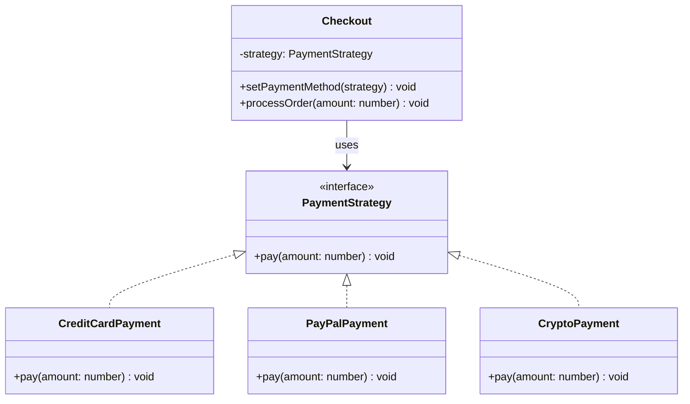

<p align="center">
  
  
</p>

# 🎭 Strategy Pattern

> **Define a family of algorithms, encapsulate each one, and make them interchangeable. Strategy lets the algorithm vary independently from the clients that use it.**
>
> — _Gang of Four_

---

## 🔴 The Problem

Imagine you're building an **online checkout system**. At first, you only support credit card payments, so you hardcode the payment logic directly inside the `Checkout` class.

But then product requirements grow:

- 💳 Credit Card
- 🅿️ PayPal
- ₿ Cryptocurrency

**Without the Strategy pattern**, you'd end up with something like this:

```typescript
// ❌ Bad: Giant if-else chain that grows with every new payment method
class Checkout {
  processOrder(amount: number, method: string): void {
    if (method === "credit-card") {
      // ... credit card logic
    } else if (method === "paypal") {
      // ... paypal logic
    } else if (method === "crypto") {
      // ... crypto logic
    }
    // 🚨 Every new method = modify this class = violates Open/Closed Principle
  }
}
```

**What's wrong with this?**

| Issue                              | Why It Hurts                                                        |
| ---------------------------------- | ------------------------------------------------------------------- |
| **Violates Open/Closed Principle** | Adding a new payment method requires modifying existing code        |
| **Tight coupling**                 | The `Checkout` class knows about every payment provider's internals |
| **Hard to test**                   | You can't test one payment method in isolation                      |
| **Code bloat**                     | The class grows endlessly as methods are added                      |

---

## 🟢 The Solution

The Strategy pattern tells us to:

1. **Extract** each algorithm (payment method) into its own class.
2. **Define** a common interface that all strategies must follow.
3. **Inject** the desired strategy into the context object at runtime.



Now, adding a new payment method is as simple as creating a **new class** — no existing code needs to change.

---

## 💡 The Essence

> **Instead of hardcoding behavior, delegate it to interchangeable objects that share the same interface.**

Think of it like a **power drill with swappable bits** 🔧 — the drill (context) doesn't care what bit (strategy) is attached; it just calls `drill()`. You swap the bit depending on the material, not rebuild the entire tool.

---

## 🏃 Running The Example

```bash
npm install
npx ts-node payment-strategy.ts
```

**Expected output:**

```
Processing credit card payment of $100
Sending $250 via Bitcoin network
```

---

## 📝 Code Walkthrough

### 1. Strategy Interface

```typescript
interface PaymentStrategy {
  pay(amount: number): void;
}
```

> The contract every payment method must fulfill.

### 2. Concrete Strategies

```typescript
class CreditCardPayment implements PaymentStrategy {
  public pay(amount: number): void {
    console.log(`Processing credit card payment of $${amount}`);
  }
}

class PayPalPayment implements PaymentStrategy {
  /* ... */
}
class CryptoPayment implements PaymentStrategy {
  /* ... */
}
```

> Each strategy encapsulates one algorithm behind the same interface.

### 3. Context

```typescript
class Checkout {
  private strategy: PaymentStrategy;

  constructor(strategy: PaymentStrategy) {
    this.strategy = strategy;
  }

  public setPaymentMethod(strategy: PaymentStrategy): void {
    this.strategy = strategy;
  }

  public processOrder(amount: number): void {
    this.strategy.pay(amount);
  }
}
```

> The context delegates behavior to the current strategy — it doesn't know or care which one is active.

### 4. Runtime Flexibility

```typescript
const checkout = new Checkout(new CreditCardPayment());
checkout.processOrder(100);

// Swap strategy at runtime — no code changes needed!
checkout.setPaymentMethod(new CryptoPayment());
checkout.processOrder(250);
```

---

## ✅ When to Use

- You have **multiple algorithms** for the same task and need to switch between them.
- You want to **eliminate conditional statements** (if/else, switch) for selecting behavior.
- You need **different variants of an algorithm** and want to isolate them from each other.

## ❌ When NOT to Use

- You only have **one or two simple algorithms** that rarely change — a simple `if/else` is fine.
- The overhead of creating separate classes **outweighs the flexibility benefit**.

---

## 🌍 Real-World Examples

| Domain             | Context         | Strategies                       |
| ------------------ | --------------- | -------------------------------- |
| **Sorting**        | Sort function   | QuickSort, MergeSort, BubbleSort |
| **Compression**    | File compressor | ZIP, GZIP, BZIP2                 |
| **Authentication** | Auth service    | JWT, OAuth, API Key              |
| **Logging**        | Logger          | Console, File, Cloud             |

---

<p align="center">
  <a href="../../../README.md">⬅ Back to Home</a> · <a href="../../README.md">📘 All GoF Patterns</a>
</p>
