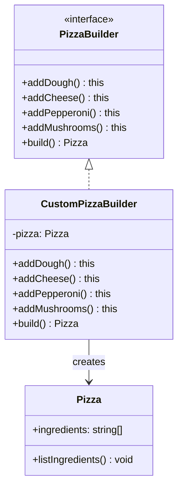

<p align="center">
  
  
</p>

# 🏭 Builder Pattern

> **Separate the construction of a complex object from its representation so that the same construction process can create different representations.**
>
> — _Gang of Four_

---

## 🔴 The Problem

Imagine you're building a **pizza ordering system**. A pizza has many optional parts: dough type, cheese, pepperoni, mushrooms, olives, onions, and more.

**Without the Builder pattern**, you'd face one of these bad options:

### ❌ Option A: Telescoping Constructor

```typescript
// 😵 Which argument is which? What if I only want cheese and mushrooms?
const pizza = new Pizza("thin", "mozzarella", null, "mushrooms", null, null);
```

### ❌ Option B: Setters Everywhere

```typescript
// 😬 Object is mutable and can be in an incomplete/invalid state
const pizza = new Pizza();
pizza.setDough("thin");
pizza.setCheese("mozzarella");
// Forgot to call build()? Pizza is half-configured...
```

**What's wrong with these approaches?**

| Issue              | Why It Hurts                                                              |
| ------------------ | ------------------------------------------------------------------------- |
| **Hard to read**   | You can't tell what each parameter means without checking the constructor |
| **Fragile**        | Adding a new optional parameter breaks all existing callers               |
| **Invalid states** | Objects can exist in partially constructed, invalid configurations        |
| **No fluent API**  | Construction code is verbose and error-prone                              |

---

## 🟢 The Solution

The Builder pattern provides a **step-by-step construction API** that:

1. **Separates** object construction from its final representation.
2. **Uses method chaining** for a fluent, readable API.
3. **Ensures** a valid object is produced only when `build()` is called.



Now, constructing a pizza reads like a sentence:

```typescript
const pizza = builder.addDough().addCheese().addPepperoni().build();
```

---

## 💡 The Essence

> **Build complex objects piece by piece through a fluent interface, ensuring validity at the end.**

Think of it like ordering at **Subway** 🥪 — you don't get a pre-made sandwich with random ingredients. You tell the builder step by step: bread → cheese → meat → veggies → sauce → done. The sandwich is only "built" when you say so.

---

## 🏃 Running The Example

```bash
npm install
npx ts-node pizza-builder.ts
```

**Expected output:**

```
Pizza has: Thin Dough, Mozzarella Cheese, Spicy Pepperoni
```

---

## 📝 Code Walkthrough

### 1. The Product

```typescript
class Pizza {
  public ingredients: string[] = [];

  public listIngredients(): void {
    console.log(`Pizza has: ${this.ingredients.join(", ")}`);
  }
}
```

> The complex object being built. It doesn't know how it's constructed.

### 2. Builder Interface

```typescript
interface PizzaBuilder {
  addDough(): this;
  addCheese(): this;
  addPepperoni(): this;
  addMushrooms(): this;
  build(): Pizza;
}
```

> Defines the steps available for construction. Returning `this` enables **method chaining**.

### 3. Concrete Builder

```typescript
class CustomPizzaBuilder implements PizzaBuilder {
  private pizza: Pizza;

  constructor() {
    this.pizza = new Pizza();
  }

  public addDough(): this {
    this.pizza.ingredients.push("Thin Dough");
    return this;
  }

  // ... other add methods ...

  public build(): Pizza {
    const result = this.pizza;
    this.pizza = new Pizza(); // Reset for next build
    return result;
  }
}
```

> Implements each step while accumulating state. The `build()` method finalizes and resets.

### 4. Fluent Usage

```typescript
const builder = new CustomPizzaBuilder();
const myPizza = builder.addDough().addCheese().addPepperoni().build();

myPizza.listIngredients();
```

> Clean, readable, self-documenting construction.

---

## ✅ When to Use

- The object has **many optional parameters** or configurations.
- You want a **fluent, readable API** for constructing objects.
- The construction process must allow **different representations** of the same product.
- You want to **prevent invalid/incomplete objects** from being created.

## ❌ When NOT to Use

- The object is **simple** with only a few required fields — a regular constructor is fine.
- You need **immutable objects** without a complex construction process.

---

## 🌍 Real-World Examples

| Domain            | Builder          | Product                |
| ----------------- | ---------------- | ---------------------- |
| **HTTP Requests** | `RequestBuilder` | `HttpRequest`          |
| **SQL Queries**   | `QueryBuilder`   | `SELECT ... WHERE ...` |
| **UI Components** | `DialogBuilder`  | `AlertDialog`          |
| **Test Data**     | `UserBuilder`    | `User` fixture         |

### 🔗 Real Project Usage

An example of the Builder pattern in a production NestJS project for constructing event filter queries:

👉 [event-filter.builder.ts](https://github.com/ross2p/ems-api/blob/main/src/modules/event/event-filter.builder.ts)

---

<p align="center">
  <a href="../../../README.md">⬅ Back to Home</a> · <a href="../../README.md">📘 All GoF Patterns</a>
</p>
