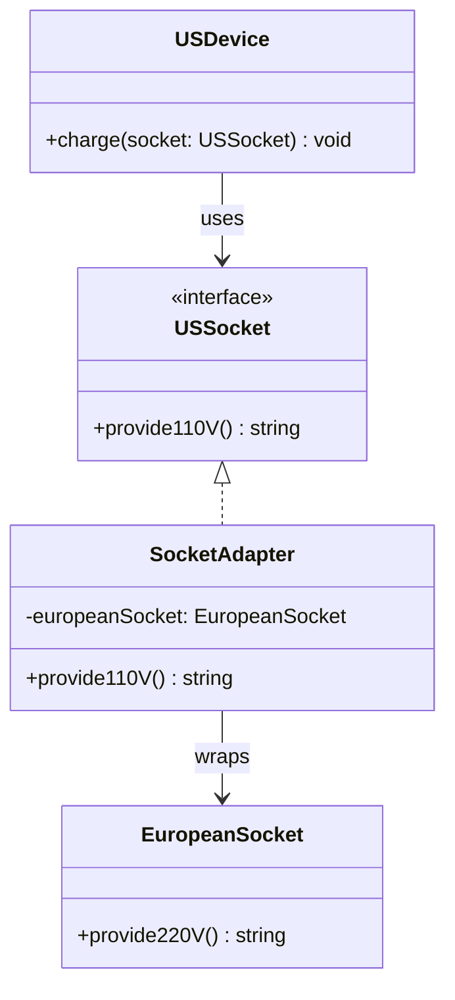

<p align="center">
  
  
</p>

# 🔌 Adapter Pattern

> **Convert the interface of a class into another interface that clients expect. Adapter lets classes work together that couldn't otherwise because of incompatible interfaces.**
>
> — _Gang of Four_

---

## 🔴 The Problem

Imagine you're traveling from the **USA to Europe** ✈️. You bring your phone charger, but European outlets provide **220V** through a different socket shape, while your device needs **110V** through a US plug.

You **can't modify** the European power grid, and you **can't rebuild** your phone's charging circuit. But you still need them to work together.

In software, this happens constantly:

- Your app expects data in **JSON**, but a third-party API sends **XML**.
- Your code uses a `Logger` interface, but the library you want to use has a `Writer` class.
- A legacy system provides `getItems()`, but your new code expects `fetchAll()`.

**Without the Adapter pattern:**

```typescript
// ❌ Bad: Direct usage fails because interfaces don't match
class USDevice {
  charge(socket: USSocket): void {
    /* expects 110V */
  }
}

const europeanOutlet = new EuropeanSocket(); // provides 220V
const phone = new USDevice();
phone.charge(europeanOutlet); // 💥 Type error! Incompatible interfaces!
```

**What's wrong?**

| Issue                             | Why It Hurts                                     |
| --------------------------------- | ------------------------------------------------ |
| **Incompatible interfaces**       | Two perfectly good components can't communicate  |
| **Can't modify third-party code** | You don't own the library/API/legacy system      |
| **Tight coupling**                | Rewriting your code for each vendor locks you in |

---

## 🟢 The Solution

The Adapter pattern introduces a **wrapper class** that:

1. **Implements** the interface the client expects (Target).
2. **Wraps** the incompatible object (Adaptee).
3. **Translates** calls from the Target interface to the Adaptee's interface.



The adapter acts as a bridge — the client works with a familiar interface, unaware that a translation is happening behind the scenes.

---

## 💡 The Essence

> **Wrap an incompatible object in a translator that speaks the language the client expects.**

Think of it like a **travel power adapter** 🔌 — it doesn't change the electricity itself; it simply makes the **plug shape** compatible so your device can connect to a foreign outlet.

---

## 🏃 Running The Example

```bash
npm install
npx ts-node charger-adapter.ts
```

**Expected output:**

```
Charging device: Providing 220V power -> Adapter converts to 110V
```

---

## 📝 Code Walkthrough

### 1. The Adaptee (Existing, Incompatible Class)

```typescript
class EuropeanSocket {
  public provide220V(): string {
    return "Providing 220V power";
  }
}
```

> The existing component with the interface we **can't change**.

### 2. The Target Interface (What the Client Expects)

```typescript
interface USSocket {
  provide110V(): string;
}
```

> The interface our client code is written against.

### 3. The Adapter (The Bridge)

```typescript
class SocketAdapter implements USSocket {
  private europeanSocket: EuropeanSocket;

  constructor(europeanSocket: EuropeanSocket) {
    this.europeanSocket = europeanSocket;
  }

  public provide110V(): string {
    const voltage = this.europeanSocket.provide220V();
    return `${voltage} -> Adapter converts to 110V`;
  }
}
```

> Implements the Target interface, internally delegates to the Adaptee, and **translates** the result.

### 4. The Client (Uses the Target Interface)

```typescript
class USDevice {
  public charge(socket: USSocket): void {
    console.log(`Charging device: ${socket.provide110V()}`);
  }
}
```

> Doesn't know about the European socket at all — it just calls `provide110V()`.

### 5. Putting It Together

```typescript
const euSocket = new EuropeanSocket();
const adapter = new SocketAdapter(euSocket);
const myPhone = new USDevice();

myPhone.charge(adapter); // Works seamlessly!
```

---

## ✅ When to Use

- You need to use an **existing class** but its interface doesn't match what you need.
- You want to create a **reusable class** that cooperates with unrelated or unforeseen classes.
- You're integrating with **third-party libraries** or **legacy systems** whose code you can't modify.

## ❌ When NOT to Use

- The interfaces are **already compatible** — don't add unnecessary indirection.
- You have **full control** over both sides — consider refactoring instead of adapting.
- The transformation is **too complex** — a full translation layer or anti-corruption layer may be more appropriate.

---

## 🌍 Real-World Examples

| Domain           | Client Expects            | Adaptee Provides                  | Adapter                |
| ---------------- | ------------------------- | --------------------------------- | ---------------------- |
| **Database**     | `Repository.find()`       | `MongoClient.collection().find()` | `MongoRepository`      |
| **Payments**     | `PaymentGateway.charge()` | `Stripe.paymentIntents.create()`  | `StripeAdapter`        |
| **Logging**      | `Logger.log()`            | `Winston.info()`                  | `WinstonLoggerAdapter` |
| **File Storage** | `Storage.upload()`        | `S3.putObject()`                  | `S3StorageAdapter`     |

---

<p align="center">
  <a href="../../../README.md">⬅ Back to Home</a> · <a href="../../README.md">📘 All GoF Patterns</a>
</p>
