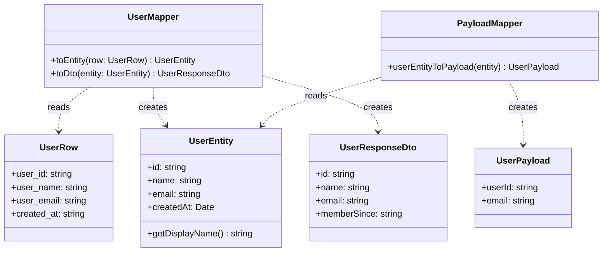

<p align="center">
  
  
</p>

# 🔄 Data Mapper Pattern

> **A layer of mappers that moves data between objects and a database while keeping them independent of each other and the mapper itself.**
>
> — _Martin Fowler, PofEAA_

---

## 🔴 The Problem

In any non-trivial application, data exists in **multiple representations**:

| Layer        | Representation                     | Example                                                         |
| ------------ | ---------------------------------- | --------------------------------------------------------------- |
| **Database** | Raw rows with `snake_case` columns | `{ user_id: "42", user_name: "Alice", created_at: "2024-..." }` |
| **Domain**   | Rich entity objects with methods   | `UserEntity` with `.getDisplayName()`                           |
| **API**      | DTOs shaped for the client         | `{ id: "42", name: "Alice", memberSince: "June 15, 2024" }`     |
| **Auth**     | Minimal token payloads             | `{ userId: "42", email: "alice@..." }`                          |

**Without the Mapper pattern**, conversion logic leaks everywhere:

```typescript
// ❌ Bad: Conversion scattered across controller, service, middleware...
app.get("/users/:id", async (req, res) => {
  const row = await db.query("SELECT * FROM users WHERE user_id = $1", [
    req.params.id,
  ]);

  // Mapping logic mixed with routing logic
  res.json({
    id: row.user_id, // rename field
    name: row.user_name, // rename field
    email: row.user_email, // rename field
    memberSince: new Date(row.created_at).toLocaleDateString(), // transform
  });
});
```

**What's wrong?**

| Issue                          | Why It Hurts                                                  |
| ------------------------------ | ------------------------------------------------------------- |
| **Duplicated transformations** | The same field mapping is copy-pasted across 15 endpoints     |
| **Mixed concerns**             | Controllers do routing AND data transformation AND formatting |
| **Fragile**                    | Renaming a DB column requires finding every place it's mapped |
| **Untestable**                 | You can't test the mapping logic in isolation                 |
| **Inconsistent**               | Different endpoints format the same entity differently        |

---

## 🟢 The Solution

The Data Mapper pattern centralizes all conversion logic into **dedicated mapper classes**. Each mapper knows how to convert between two representations — and nothing else.



Each layer only knows its **own representation**. The mappers are the **only place** where field renaming, type conversion, and formatting happen.

---

## 💡 The Essence

> **Isolate "shape-shifting" logic into dedicated classes so each layer of your app speaks its own language without knowing anyone else's.**

Think of it like an **interpreter at the UN** 🌐 — the French delegate speaks French, the Japanese delegate speaks Japanese. Neither needs to learn the other's language. The interpreter (mapper) translates between them — and that's their only job.

---

## 🏃 Running The Example

```bash
npm install
npx ts-node user-mapper.ts
```

**Expected output:**

```
🏗️  Domain Entity: UserEntity { id: 'usr_42', name: 'Alice Johnson', ... }
   Display Name: Alice Johnson <alice@example.com>

📤 API Response DTO: { id: 'usr_42', name: 'Alice Johnson', memberSince: 'June 15, 2024' }

🔐 JWT Payload: { userId: 'usr_42', email: 'alice@example.com' }

📋 Batch mapped DTOs: [ { ... Alice ... }, { ... Bob ... } ]
```

---

## 📝 Code Walkthrough

### 1. Different Representations

```typescript
// Database row (snake_case, raw strings)
interface UserRow {
  user_id: string;
  user_name: string;
  user_email: string;
  created_at: string;
}

// Domain entity (camelCase, proper types, behavior)
class UserEntity {
  constructor(
    public readonly id: string,
    public readonly name: string,
    public readonly email: string,
    public readonly createdAt: Date,
  ) {}

  public getDisplayName(): string {
    return `${this.name} <${this.email}>`;
  }
}

// API response (formatted for the client)
interface UserResponseDto {
  id: string;
  name: string;
  email: string;
  memberSince: string; // human-readable date
}
```

> Each representation serves a different purpose with different field names, types, and structures.

### 2. The Mapper

```typescript
class UserMapper implements Mapper<UserEntity, UserResponseDto> {
  public toEntity(row: UserRow): UserEntity {
    return new UserEntity(
      row.user_id,
      row.user_name,
      row.user_email,
      new Date(row.created_at),
    );
  }

  public toDto(entity: UserEntity): UserResponseDto {
    return {
      id: entity.id,
      name: entity.name,
      email: entity.email,
      memberSince: entity.createdAt.toLocaleDateString("en-US", {
        year: "numeric",
        month: "long",
        day: "numeric",
      }),
    };
  }
}
```

> **One class, one responsibility** — all field mapping, type conversion, and formatting in one place.

### 3. Specialized Mapper for Auth

```typescript
class PayloadMapper {
  public userEntityToPayload(entity: UserEntity): UserPayload {
    return {
      userId: entity.id,
      email: entity.email,
    };
  }
}
```

> A focused mapper that extracts **only** what's needed for JWT tokens — no more, no less.

### 4. Usage — Clean Pipelines

```typescript
const entity = userMapper.toEntity(dbRow); // DB → Domain
const dto = userMapper.toDto(entity); // Domain → API
const payload = payloadMapper.userEntityToPayload(entity); // Domain → JWT
```

> Each conversion step is explicit, testable, and reusable.

---

## ✅ When to Use

- Your data passes through **multiple layers** with different shapes (DB → Domain → API → Auth).
- You want **one source of truth** for how fields are mapped and transformed.
- Field names, types, or formats differ between layers (`snake_case` → `camelCase`, `string` → `Date`).
- You need to **test conversions** independently from database or HTTP logic.

## ❌ When NOT to Use

- The object has the **exact same shape** across all layers — mapping adds unnecessary boilerplate.
- You're using a framework that handles mapping **automatically** (e.g. GraphQL resolvers).

---

## 🌍 Real-World Examples

| Source                | Target           | Mapper                                |
| --------------------- | ---------------- | ------------------------------------- |
| Database row          | Domain entity    | `UserMapper.toEntity()`               |
| Domain entity         | API response DTO | `UserMapper.toDto()`                  |
| Domain entity         | JWT payload      | `PayloadMapper.userEntityToPayload()` |
| External API response | Internal model   | `ExternalServiceMapper`               |
| CSV row               | Import entity    | `CsvRowMapper`                        |

### 🔗 Real Project Usage

A production NestJS mapper that converts `UserEntity` to JWT token payload:

👉 [payload.mapper.ts](https://github.com/ross2p/ems-api/blob/4c11509dc306032719d7541d8f4d4059b1f078fb/src/modules/token/payload.mapper.ts)

Key observations from the real implementation:

- Uses **dependency injection** (`@Injectable()`) for easy testing and composition
- Mappers are **stateless** — they only transform data, never store it
- Extracts the **minimal data** needed for JWT payloads (just `userId` and `email`)

---

<p align="center">
  <a href="../../README.md">⬅ Back to Home</a> · <a href="../README.md">📗 All PofEAA Patterns</a>
</p>
