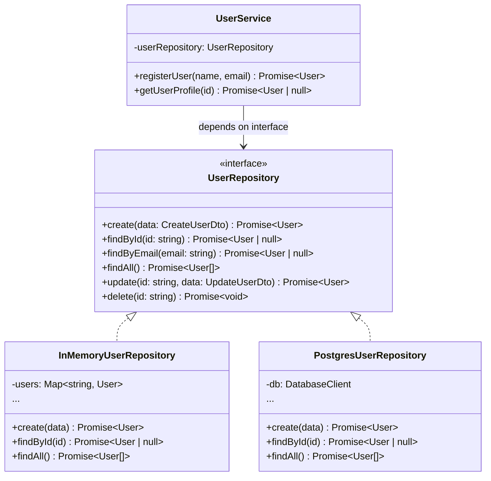

<p align="center">
  
  
</p>

# 🗄️ Repository Pattern

> **Mediates between the domain and data mapping layers using a collection-like interface for accessing domain objects.**
>
> — _Martin Fowler, PofEAA_

---

## 🔴 The Problem

Imagine you're building a **user management system**. Your service layer needs to create, read, update, and delete users. The quickest approach is to put database queries directly in the service:

```typescript
// ❌ Bad: Database logic scattered throughout the service layer
class UserService {
  async getUser(id: string) {
    // Raw SQL mixed with business logic
    const result = await db.query("SELECT * FROM users WHERE id = $1", [id]);
    return result.rows[0];
  }

  async registerUser(name: string, email: string) {
    // What if we switch from PostgreSQL to MongoDB?
    // Every method in every service needs to change!
    const result = await db.query(
      "INSERT INTO users (name, email) VALUES ($1, $2) RETURNING *",
      [name, email],
    );
    return result.rows[0];
  }
}
```

**What's wrong with this?**

| Issue                   | Why It Hurts                                                        |
| ----------------------- | ------------------------------------------------------------------- |
| **Coupled to database** | Changing from PostgreSQL to MongoDB means rewriting every service   |
| **Untestable**          | You need a real database to test business logic                     |
| **Duplicated queries**  | The same `SELECT * FROM users WHERE email = ?` appears in 10 places |
| **No abstraction**      | Business logic and data access are mixed together                   |
| **Hard to optimize**    | Adding caching, logging, or query optimization affects all callers  |

---

## 🟢 The Solution

The Repository pattern introduces an **abstraction layer** between your domain/service logic and the data source. It provides a **collection-like interface** — you ask for objects and get them, without knowing how or where they're stored.



Now the service only talks to the **interface**. Swapping databases, adding caching, or writing tests becomes trivial.

---

## 💡 The Essence

> **Treat your data source like a collection of objects — hide the "how" of storage behind a clean interface.**

Think of it like a **library catalog system** 📚 — you tell the librarian "find me a book by title", not "go to aisle 3, shelf B, position 7". The librarian (repository) knows where things are stored; you (the service) just care about getting the book.

---

## 🏃 Running The Example

```bash
npm install
npx ts-node user-repository.ts
```

**Expected output:**

```
✅ Created: { id: '1', name: 'Alice', email: 'alice@example.com', createdAt: ... }
✅ Created: { id: '2', name: 'Bob', email: 'bob@example.com', createdAt: ... }

🔍 Found user: { id: '1', name: 'Alice', email: 'alice@example.com', ... }

✏️  Updated: { id: '1', name: 'Alice Smith', email: 'alice@example.com', ... }

📋 All users: [ ... 2 users ... ]

🗑️  After deleting Bob: [ ... 1 user ... ]
```

---

## 📝 Code Walkthrough

### 1. Repository Interface

```typescript
interface UserRepository {
  create(data: CreateUserDto): Promise<User>;
  findById(id: string): Promise<User | null>;
  findByEmail(email: string): Promise<User | null>;
  findAll(): Promise<User[]>;
  update(id: string, data: UpdateUserDto): Promise<User>;
  delete(id: string): Promise<void>;
}
```

> A **collection-like contract** — the service doesn't know if data comes from a Map, PostgreSQL, or an API.

### 2. Concrete Implementation

```typescript
class InMemoryUserRepository implements UserRepository {
  private users: Map<string, User> = new Map();

  async create(data: CreateUserDto): Promise<User> {
    const user: User = {
      id: String(this.nextId++),
      ...data,
      createdAt: new Date(),
    };
    this.users.set(user.id, user);
    return user;
  }

  async findById(id: string): Promise<User | null> {
    return this.users.get(id) ?? null;
  }
  // ...
}
```

> The in-memory version is perfect for **testing**. In production, you'd swap in `PostgresUserRepository` or `PrismaUserRepository`.

### 3. Service Layer (Client)

```typescript
class UserService {
  constructor(private readonly userRepository: UserRepository) {}

  async registerUser(name: string, email: string): Promise<User> {
    const existing = await this.userRepository.findByEmail(email);
    if (existing) throw new Error(`User already exists`);
    return this.userRepository.create({ name, email });
  }
}
```

> Business logic lives here. It relies only on the **interface**, never on a specific database.

---

## ✅ When to Use

- You want to **decouple** business logic from the data access layer.
- You need to **swap storage mechanisms** (SQL → NoSQL, API → local cache) without changing services.
- You want to **unit test** services without hitting a real database.
- Multiple parts of the app access the **same entity** — centralizing queries prevents duplication.

## ❌ When NOT to Use

- The application is **very simple** (e.g. a single-table CRUD) — an ORM alone may suffice.
- You're using an ORM that **already acts as a repository** (e.g. TypeORM's `Repository<T>`).

---

## 🌍 Real-World Examples

| Domain       | Repository          | Storage                        |
| ------------ | ------------------- | ------------------------------ |
| **Users**    | `UserRepository`    | PostgreSQL, MongoDB, In-Memory |
| **Products** | `ProductRepository` | Elasticsearch, SQL             |
| **Orders**   | `OrderRepository`   | DynamoDB, Redis                |
| **Files**    | `FileRepository`    | S3, Local filesystem           |

### 🔗 Real Project Usage

A production NestJS implementation using Prisma ORM as the storage backend:

👉 [user.repository.ts](https://github.com/ross2p/ems-api/blob/4c11509dc306032719d7541d8f4d4059b1f078fb/src/modules/user/user.repository.ts)

Key observations from the real implementation:

- Uses **dependency injection** (`@Injectable()`) to inject the `DatabaseService`
- Wraps **Prisma's delegate** (`db.user`) instead of writing raw SQL
- Provides **domain-specific methods** like `findUserByEmailWithPassword()`

---

<p align="center">
  <a href="../../README.md">⬅ Back to Home</a> · <a href="../README.md">📗 All PofEAA Patterns</a>
</p>
